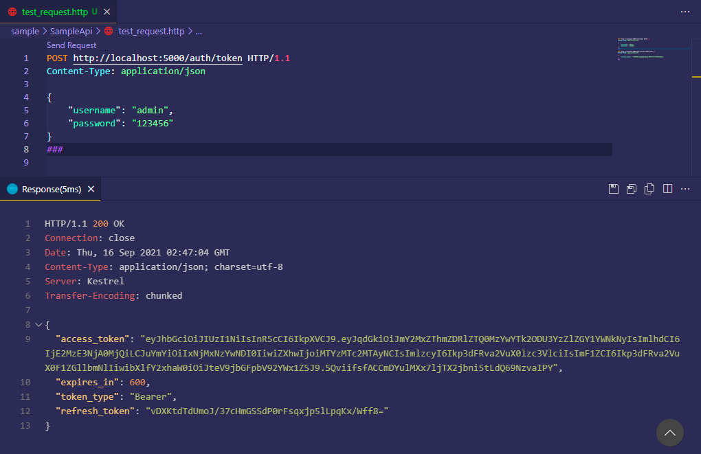
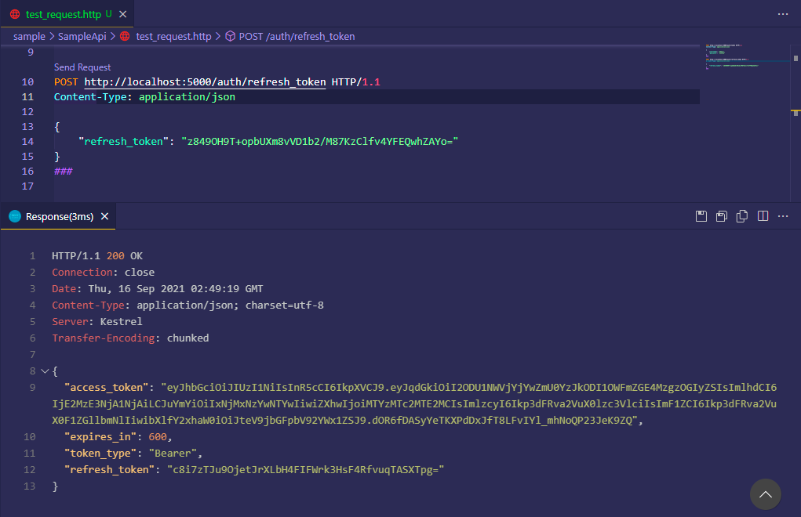

# JwtTokenMiddleware

:star: a simple jwt-token middleware for asp.net core


## Preview

### get token



### refresh token




## Sample Usage

First, add service and configure options:

```c#
public void ConfigureServices(IServiceCollection services)
{
    services.AddControllers();
    
    services.AddJwtTokenAuthentication(options =>
    {
        // options.Issuer = "my_iss";
        // options.Audience = "my_iss";
        // options.ExpiresIn = TimeSpan.FromMinutes(30);
        // options.TokenPath = "/token";
        // options.RefreshTokenPath = "/refresh_token";
        options.SecurityKey = "B3SACXE7shay8+mNe59qO987DM94+YOrzNtUex5I2UI=";
        options.RegisterHandle<MyHandle>();
    });
}
```

Then, implement your handler, for example:

```c#
public class MyHandle : JwtTokenHandle<MyJwtTokenRequest, MyJwtRefreshTokenRequest>
{
    protected override async Task<Tuple<bool, List<Claim>>> TokenHandleValidateAsync(MyJwtTokenRequest req)
    {
        await Task.CompletedTask;
        
        // validate logic ...
        var result = req.Username == "admin" && req.Password == "123456";
        if (!result)
            return new Tuple<bool, List<Claim>>(false, null);
        
        var claims = new List<Claim> {new Claim("my_claim", "my_claim_value")};
        return new Tuple<bool, List<Claim>>(true, claims);
    }
    
    protected override async Task<Tuple<bool, List<Claim>>> RefreshTokenHandleValidateAsync(
        MyJwtRefreshTokenRequest req)
    {
        await Task.CompletedTask;
        
        // validate logic ...
        var result = req.RefreshToken == "z849OH9T+opbUXm8vVD1b2/M87KzClfv4YFEQwhZAYo=";
        if (!result)
            return new Tuple<bool, List<Claim>>(false, null);
        
        var claims = new List<Claim> {new Claim("my_claim", "my_claim_value")};
        return new Tuple<bool, List<Claim>>(true, claims);
    }
    
    protected override async Task OnGenerateTokenAfterAsync(JwtTokenResponse jwtTokenResponse)
    {
        await Task.CompletedTask;
        
        // save the refresh_token to database ...
    }
}
```

Define your request parameters:

```c#
public class MyJwtTokenRequest : JwtTokenRequest
{
    // custom parameters
}

public class MyJwtRefreshTokenRequest : JwtRefreshTokenRequest
{
    // custom parameters
}
```

Finally, use this middleware:

```c#
public void Configure(IApplicationBuilder app, IWebHostEnvironment env)
{
    if (env.IsDevelopment())
    {
        app.UseDeveloperExceptionPage();
    }
    app.UseRouting();
    app.UseAuthentication();
    app.UseAuthorization();
    
    app.UseJwtToken(); // add this line
    
    app.UseEndpoints(endpoints => { endpoints.MapControllers(); });
}
```


## Give a Star! :star:

If you like or are using this project please give it a star. Thanks!

